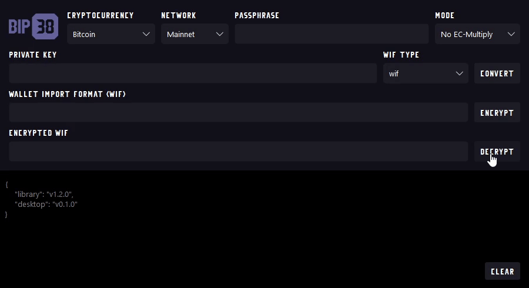

<h1 align="center" style="border-bottom: none">
    <br>Bitcoin Improvement Proposal - 0038
</h1>

<p align="center">
    <a href="https://github.com/talonlab/bip38-desktop/releases" target="_blank">Releases</a> · <a href="https://talonlab.gitbook.io/bip38/manual" target="_blank">Manual</a> ·  <a href="#donations">Donation</a>
</p>

<div align="center">


</div>

A cross-platform client desktop application built on the [Bitcoin Improvement Proposal - 0038 (BIP38) library](https://github.com/talonlab/python-bip38). This application leverages the BIP38 library's functionality to support both No EC-multiply and EC-multiply encryption modes, compatible with over 150 cryptocurrencies.



For more info see the [Passphrase-protected private key - BIP38](https://en.bitcoin.it/wiki/BIP_0038) spec.

## Installation

### For Windows (64-bit)

To install on Windows, download one of the following from the Releases page:

- MSI Installer – Recommended for a guided installation process.

- Executable (.exe) – A standalone version that runs without installation.

Once downloaded, double-click the .msi or .exe file and follow the on-screen instructions to complete the installation.

### For Linux

To install on Linux, download one of the following from the Releases page:

Note: For ubuntu >= 22.04 install required libraries

```
sudo apt-get update
sudo apt-get install libxcb-cursor0 libxcb-cursor-dev
```

- Debian Package (.deb) – Recommended for Debian-based systems like Ubuntu and Debian.

    Installation: Open a terminal, navigate to the download location, and run:
    ```
    sudo dpkg -i bip38-desktop-x.x.x-amd64.deb
    ```

- AppImage– A portable format compatible with most Linux distributions.

    Installation: Make the file executable and run:
    ```
    chmod +x bip38-desktop-x.x.x-x86_64.AppImage
    ```
    ```
    ./bip38-desktop-x.x.x-x86_64.AppImage
    ```

### For Mac

To install on Mac, download one of the following from the Releases page:

1. **Install OpenSSL** (a required dependency if not already installed):
```bash
brew install openssl
```
2. **Set up OpenSSL** environment variables to ensure it is correctly linked for development:
```bash
echo 'export LDFLAGS=-L$(brew --prefix openssl)/lib' >> ~/.zshrc
echo 'export CPPFLAGS=-I$(brew --prefix openssl)/include' >> ~/.zshrc
echo 'export PKG_CONFIG_PATH=$(brew --prefix openssl)/lib/pkgconfig' >> ~/.zshrc
echo 'export PATH=$(brew --prefix openssl)/bin:$PATH' >> ~/.zshrc
source ~/.zshrc
```
- macOS App Bundle (.app):
   - Available as a `.zip` file.
   - Two versions:
     - **arm64**: For Apple Silicon `M` series devices.
     - **x64**: For Intel-based Macs.

- macOS Disk Image (.dmg):
   - A convenient format for installation on macOS.
   - Two versions:
     - **arm64**: For Apple Silicon `M` series devices.
     - **x64**: For Intel-based Macs.

## Development

Fork the Repository: Fork this repository to your GitHub account.

Clone Locally: Clone the repository to your local machine. You can also clone the latest development version directly from GitHub:

```
git clone https://github.com/talonlab/bip38-desktop.git
```

Install Requirements: Navigate to the project directory and install the required dependencies:

```
pip install -r requirements.txt
```

## Contributing

Feel free to open an [issue](https://github.com/talonlab/bip38-desktop/issues) if you find a problem,
or a pull request if you've solved an issue. And also any help in testing, development,
documentation and other tasks is highly appreciated and useful to the project.
There are tasks for contributors of all experience levels.

For more information, see the [CONTRIBUTING.md](https://github.com/talonlab/bip38-desktop/blob/master/CONTRIBUTING.md) file.

## Donations

Your contributions help us maintain and improve this tool for the community. 
If you find our work helpful, consider supporting the project:

- **Bitcoin** - 16c7ajUwHEMaafrceuYSrd35SDjmfVdjoS
- **Ethereum / ERC20** - 0xD3cbCB0B6F82A03C715D665b72dC44CEf54e6D9B
- **Solana** - 9cVoan5GvnpVvysEkFWEFR4k9cpTdWKmqQ6Gi7nwM5ES

Thank you very much for your support.

## License

Distributed under the [MIT](https://github.com/talonlab/bip38-desktop/blob/master/LICENSE) license. See ``LICENSE`` for more information.
