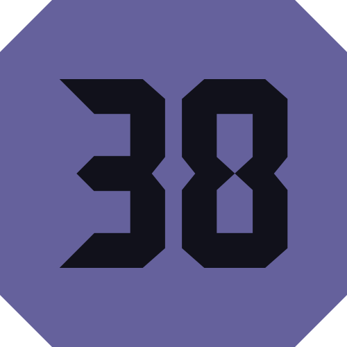

<h1 align="center" style="border-bottom: none">
    <br>Bitcoin Improvement Proposal - 0038
</h1>

<p align="center">
    <a href="https://github.com/talonlab/python-bip38/releases" target="_blank">Releases</a> · <a href="https://talonlab.gitbook.io/bip38/manual" target="_blank">Manual</a> · <a href="https://bip38.readthedocs.io" target="_blank">API Docs</a> · <a href="#donations">Donation</a>
</p>

<div align="center">


[](https://pypi.org/project/bip38)


</div>

A Python library for the implementation of Bitcoin Improvement Proposal - 0038 / (BIP38) protocol.
This library supports both [No EC-multiply](https://github.com/bitcoin/bips/blob/master/bip-0038.mediawiki#encryption-when-ec-multiply-flag-is-not-used) and [EC-multiply](https://github.com/bitcoin/bips/blob/master/bip-0038.mediawiki#encryption-when-ec-multiply-mode-is-used) modes and is compatible with over 150+ cryptocurrencies.
It's specifically tailored for Pay-to-PubKey-Hash (P2PKH) address types.


For more info see the [Passphrase-protected private key - BIP38](https://en.bitcoin.it/wiki/BIP_0038) spec.

## Installation

The easiest way to install `bip38` library is via pip:

```
pip install bip38
```

### For Windows (64-bit)

To install on Windows, download one of the following from the Releases page:

[MSI](https://github.com/talonlab/bip38-desktop/releases) Installer – Recommended for a guided installation process.

[Executable](https://github.com/talonlab/bip38-desktop/releases) (.exe) – A standalone version that runs without installation.
Once downloaded, double-click the .msi or .exe file and follow the on-screen instructions to complete the installation.

### For Linux

To install on Linux, download one of the following from the Releases page:

[Debian Package (.deb)](https://github.com/talonlab/bip38-desktop/releases) – Recommended for Debian-based systems like Ubuntu and Debian.

Installation: Open a terminal, navigate to the download location, and run:
```
sudo dpkg -i bip38-desktop-0.1.0-amd64.deb
```

[AppImage](https://github.com/talonlab/bip38-desktop/releases) – A portable format compatible with most Linux distributions.

Installation: Make the file executable and run:
```
chmod +x bip38-desktop-0.1.0-x86_64.AppImage
```
```
./ bip38-desktop-0.1.0-x86_64.AppImage
```

## Development

Fork the Repository: Fork this repository to your GitHub account.

Clone Locally: Clone the repository to your local machine. You can also clone the latest development version directly from GitHub:

```
git clone https://github.com/talonlab/bip38-desktop.git
```

Install Requirements: Navigate to the project directory and install the required dependencies:

```
pip install -r requirements.txt
```


## Contributing

Feel free to open an [issue](https://github.com/talonlab/python-bip38/issues) if you find a problem,
or a pull request if you've solved an issue. And also any help in testing, development,
documentation and other tasks is highly appreciated and useful to the project.
There are tasks for contributors of all experience levels.

For more information, see the [CONTRIBUTING.md](https://github.com/talonlab/python-bip38/blob/master/CONTRIBUTING.md) file.

## Supported Cryptocurrencies

This module supports more than 150+ cryptocurrencies, including the following:

<table><thead><tr><th align='left'><div style="margin: 0;">Name</div></th><th><div style="margin: 0;">Network</div></th><th><div style="margin: 0;">WIF Prefix</div></th><th><div style="margin: 0;">Address Prefix</div></th></tr></thead><tbody><tr><td align='left' rowspan='1'>Adcoin</td><td align='center'><code>mainnet</code></td><td align='center'><code>0xb0</code></td><td align='center'><code>0x17</code></td></tr><tr><td align='left' rowspan='1'>Anon</td><td align='center'><code>mainnet</code></td><td align='center'><code>0x80</code></td><td align='center'><code>0x582</code></td></tr><tr><td align='left' rowspan='1'>Argoneum</td><td align='center'><code>mainnet</code></td><td align='center'><code>0xbf</code></td><td align='center'><code>0x32</code></td></tr><tr><td align='left' rowspan='1'>Artax</td><td align='center'><code>mainnet</code></td><td align='center'><code>0x97</code></td><td align='center'><code>0x17</code></td></tr><tr><td align='left' rowspan='1'>Aryacoin</td><td align='center'><code>mainnet</code></td><td align='center'><code>0x97</code></td><td align='center'><code>0x17</code></td></tr><tr><td align='left' rowspan='1'>Asiacoin</td><td align='center'><code>mainnet</code></td><td align='center'><code>0x97</code></td><td align='center'><code>0x17</code></td></tr><tr><td align='left' rowspan='1'>Auroracoin</td><td align='center'><code>mainnet</code></td><td align='center'><code>0x97</code></td><td align='center'><code>0x17</code></td></tr><tr><td align='left' rowspan='1'>Avian</td><td align='center'><code>mainnet</code></td><td align='center'><code>0x80</code></td><td align='center'><code>0x3c</code></td></tr><tr><td align='left' rowspan='1'>Axe</td><td align='center'><code>mainnet</code></td><td align='center'><code>0xcc</code></td><td align='center'><code>0x37</code></td></tr><tr><td align='left' rowspan='1'>Bata</td><td align='center'><code>mainnet</code></td><td align='center'><code>0xa4</code></td><td align='center'><code>0x19</code></td></tr><tr><td align='left' rowspan='1'>BeetleCoin</td><td align='center'><code>mainnet</code></td><td align='center'><code>0x99</code></td><td align='center'><code>0x1a</code></td></tr><tr><td align='left' rowspan='1'>BelaCoin</td><td align='center'><code>mainnet</code></td><td align='center'><code>0x99</code></td><td align='center'><code>0x19</code></td></tr><tr><td align='left' rowspan='1'>BitCloud</td><td align='center'><code>mainnet</code></td><td align='center'><code>0x99</code></td><td align='center'><code>0x19</code></td></tr><tr><td align='left' rowspan='1'>BitSend</td><td align='center'><code>mainnet</code></td><td align='center'><code>0xcc</code></td><td align='center'><code>0x66</code></td></tr><tr><td align='left' rowspan='3'>Bitcoin</td><td align='center'><code>mainnet</code></td><td align='center'><code>0x80</code></td><td align='center'><code>0x00</code></td></tr><tr><td align='center'><code>testnet</code></td><td align='center'><code>0xef</code></td><td align='center'><code>0x6f</code></td></tr><tr><td align='center'><code>regtest</code></td><td align='center'><code>0xef</code></td><td align='center'><code>0x6f</code></td></tr><tr><td align='left' rowspan='1'>BitcoinAtom</td><td align='center'><code>mainnet</code></td><td align='center'><code>0x80</code></td><td align='center'><code>0x17</code></td></tr><tr><td align='left' rowspan='1'>BitcoinGold</td><td align='center'><code>mainnet</code></td><td align='center'><code>0x80</code></td><td align='center'><code>0x26</code></td></tr><tr><td align='left' rowspan='1'>BitcoinGreen</td><td align='center'><code>mainnet</code></td><td align='center'><code>0x2e</code></td><td align='center'><code>0x26</code></td></tr><tr><td align='left' rowspan='1'>BitcoinPlus</td><td align='center'><code>mainnet</code></td><td align='center'><code>0x99</code></td><td align='center'><code>0x19</code></td></tr><tr><td align='left' rowspan='2'>BitcoinPrivate</td><td align='center'><code>mainnet</code></td><td align='center'><code>0x80</code></td><td align='center'><code>0x1325</code></td></tr><tr><td align='center'><code>testnet</code></td><td align='center'><code>0xef</code></td><td align='center'><code>0x1957</code></td></tr><tr><td align='left' rowspan='1'>BitcoinSV</td><td align='center'><code>mainnet</code></td><td align='center'><code>0x80</code></td><td align='center'><code>0x00</code></td></tr><tr><td align='left' rowspan='1'>BitcoinZ</td><td align='center'><code>mainnet</code></td><td align='center'><code>0x80</code></td><td align='center'><code>0x1cb8</code></td></tr><tr><td align='left' rowspan='1'>Bitcore</td><td align='center'><code>mainnet</code></td><td align='center'><code>0x80</code></td><td align='center'><code>0x03</code></td></tr><tr><td align='left' rowspan='1'>Blackcoin</td><td align='center'><code>mainnet</code></td><td align='center'><code>0x99</code></td><td align='center'><code>0x19</code></td></tr><tr><td align='left' rowspan='1'>BlockStamp</td><td align='center'><code>mainnet</code></td><td align='center'><code>0x80</code></td><td align='center'><code>0x00</code></td></tr><tr><td align='left' rowspan='2'>Blocknode</td><td align='center'><code>mainnet</code></td><td align='center'><code>0x4b</code></td><td align='center'><code>0x19</code></td></tr><tr><td align='center'><code>testnet</code></td><td align='center'><code>0x89</code></td><td align='center'><code>0x55</code></td></tr><tr><td align='left' rowspan='1'>Bolivarcoin</td><td align='center'><code>mainnet</code></td><td align='center'><code>0xd5</code></td><td align='center'><code>0x55</code></td></tr><tr><td align='left' rowspan='1'>BritCoin</td><td align='center'><code>mainnet</code></td><td align='center'><code>0x99</code></td><td align='center'><code>0x19</code></td></tr><tr><td align='left' rowspan='1'>CPUChain</td><td align='center'><code>mainnet</code></td><td align='center'><code>0x80</code></td><td align='center'><code>0x1c</code></td></tr><tr><td align='left' rowspan='1'>CanadaeCoin</td><td align='center'><code>mainnet</code></td><td align='center'><code>0x9c</code></td><td align='center'><code>0x1c</code></td></tr><tr><td align='left' rowspan='1'>Cannacoin</td><td align='center'><code>mainnet</code></td><td align='center'><code>0x9c</code></td><td align='center'><code>0x1c</code></td></tr><tr><td align='left' rowspan='1'>Clams</td><td align='center'><code>mainnet</code></td><td align='center'><code>0x85</code></td><td align='center'><code>0x89</code></td></tr><tr><td align='left' rowspan='1'>ClubCoin</td><td align='center'><code>mainnet</code></td><td align='center'><code>0x99</code></td><td align='center'><code>0x1c</code></td></tr><tr><td align='left' rowspan='1'>Compcoin</td><td align='center'><code>mainnet</code></td><td align='center'><code>0x9c</code></td><td align='center'><code>0x1c</code></td></tr><tr><td align='left' rowspan='1'>CranePay</td><td align='center'><code>mainnet</code></td><td align='center'><code>0x7b</code></td><td align='center'><code>0x1c</code></td></tr><tr><td align='left' rowspan='1'>Crave</td><td align='center'><code>mainnet</code></td><td align='center'><code>0x99</code></td><td align='center'><code>0x46</code></td></tr><tr><td align='left' rowspan='2'>Dash</td><td align='center'><code>mainnet</code></td><td align='center'><code>0xcc</code></td><td align='center'><code>0x4c</code></td></tr><tr><td align='center'><code>testnet</code></td><td align='center'><code>0xef</code></td><td align='center'><code>0x8c</code></td></tr><tr><td align='left' rowspan='1'>DeepOnion</td><td align='center'><code>mainnet</code></td><td align='center'><code>0x9f</code></td><td align='center'><code>0x1f</code></td></tr><tr><td align='left' rowspan='1'>Defcoin</td><td align='center'><code>mainnet</code></td><td align='center'><code>0x9e</code></td><td align='center'><code>0x1e</code></td></tr><tr><td align='left' rowspan='1'>Denarius</td><td align='center'><code>mainnet</code></td><td align='center'><code>0x9e</code></td><td align='center'><code>0x1e</code></td></tr><tr><td align='left' rowspan='1'>Diamond</td><td align='center'><code>mainnet</code></td><td align='center'><code>0xda</code></td><td align='center'><code>0x5a</code></td></tr><tr><td align='left' rowspan='1'>DigiByte</td><td align='center'><code>mainnet</code></td><td align='center'><code>0x80</code></td><td align='center'><code>0x1e</code></td></tr><tr><td align='left' rowspan='1'>Digitalcoin</td><td align='center'><code>mainnet</code></td><td align='center'><code>0x9e</code></td><td align='center'><code>0x1e</code></td></tr><tr><td align='left' rowspan='2'>Divi</td><td align='center'><code>mainnet</code></td><td align='center'><code>0xd4</code></td><td align='center'><code>0x1e</code></td></tr><tr><td align='center'><code>testnet</code></td><td align='center'><code>0xd4</code></td><td align='center'><code>0x1e</code></td></tr><tr><td align='left' rowspan='2'>Dogecoin</td><td align='center'><code>mainnet</code></td><td align='center'><code>0xf1</code></td><td align='center'><code>0x1e</code></td></tr><tr><td align='center'><code>testnet</code></td><td align='center'><code>0xf1</code></td><td align='center'><code>0x71</code></td></tr><tr><td align='left' rowspan='1'>EDRCoin</td><td align='center'><code>mainnet</code></td><td align='center'><code>0xdd</code></td><td align='center'><code>0x5d</code></td></tr><tr><td align='left' rowspan='1'>Ecoin</td><td align='center'><code>mainnet</code></td><td align='center'><code>0xdc</code></td><td align='center'><code>0x5c</code></td></tr><tr><td align='left' rowspan='1'>Einsteinium</td><td align='center'><code>mainnet</code></td><td align='center'><code>0xa1</code></td><td align='center'><code>0x21</code></td></tr><tr><td align='left' rowspan='1'>Elastos</td><td align='center'><code>mainnet</code></td><td align='center'><code>0x80</code></td><td align='center'><code>0x21</code></td></tr><tr><td align='left' rowspan='1'>Energi</td><td align='center'><code>mainnet</code></td><td align='center'><code>0x6a</code></td><td align='center'><code>0x21</code></td></tr><tr><td align='left' rowspan='1'>EuropeCoin</td><td align='center'><code>mainnet</code></td><td align='center'><code>0xa8</code></td><td align='center'><code>0x21</code></td></tr><tr><td align='left' rowspan='2'>Evrmore</td><td align='center'><code>mainnet</code></td><td align='center'><code>0x80</code></td><td align='center'><code>0x21</code></td></tr><tr><td align='center'><code>testnet</code></td><td align='center'><code>0xef</code></td><td align='center'><code>0x6f</code></td></tr><tr><td align='left' rowspan='1'>ExclusiveCoin</td><td align='center'><code>mainnet</code></td><td align='center'><code>0xa1</code></td><td align='center'><code>0x21</code></td></tr><tr><td align='left' rowspan='2'>FIX</td><td align='center'><code>mainnet</code></td><td align='center'><code>0x3c</code></td><td align='center'><code>0x23</code></td></tr><tr><td align='center'><code>testnet</code></td><td align='center'><code>0xed</code></td><td align='center'><code>0x4c</code></td></tr><tr><td align='left' rowspan='1'>Feathercoin</td><td align='center'><code>mainnet</code></td><td align='center'><code>0x8e</code></td><td align='center'><code>0x0e</code></td></tr><tr><td align='left' rowspan='1'>Firo</td><td align='center'><code>mainnet</code></td><td align='center'><code>0xd2</code></td><td align='center'><code>0x52</code></td></tr><tr><td align='left' rowspan='1'>Firstcoin</td><td align='center'><code>mainnet</code></td><td align='center'><code>0xa3</code></td><td align='center'><code>0x23</code></td></tr><tr><td align='left' rowspan='1'>Flashcoin</td><td align='center'><code>mainnet</code></td><td align='center'><code>0xc4</code></td><td align='center'><code>0x44</code></td></tr><tr><td align='left' rowspan='1'>Flux</td><td align='center'><code>mainnet</code></td><td align='center'><code>0x80</code></td><td align='center'><code>0x1cb8</code></td></tr><tr><td align='left' rowspan='2'>Foxdcoin</td><td align='center'><code>mainnet</code></td><td align='center'><code>0x80</code></td><td align='center'><code>0x23</code></td></tr><tr><td align='center'><code>testnet</code></td><td align='center'><code>0xef</code></td><td align='center'><code>0x5f</code></td></tr><tr><td align='left' rowspan='1'>FujiCoin</td><td align='center'><code>mainnet</code></td><td align='center'><code>0xa4</code></td><td align='center'><code>0x24</code></td></tr><tr><td align='left' rowspan='1'>GCRCoin</td><td align='center'><code>mainnet</code></td><td align='center'><code>0x9a</code></td><td align='center'><code>0x26</code></td></tr><tr><td align='left' rowspan='1'>GameCredits</td><td align='center'><code>mainnet</code></td><td align='center'><code>0xa6</code></td><td align='center'><code>0x26</code></td></tr><tr><td align='left' rowspan='1'>GoByte</td><td align='center'><code>mainnet</code></td><td align='center'><code>0xc6</code></td><td align='center'><code>0x26</code></td></tr><tr><td align='left' rowspan='1'>Gridcoin</td><td align='center'><code>mainnet</code></td><td align='center'><code>0xbe</code></td><td align='center'><code>0x3e</code></td></tr><tr><td align='left' rowspan='2'>GroestlCoin</td><td align='center'><code>mainnet</code></td><td align='center'><code>0x80</code></td><td align='center'><code>0x24</code></td></tr><tr><td align='center'><code>testnet</code></td><td align='center'><code>0xef</code></td><td align='center'><code>0x6f</code></td></tr><tr><td align='left' rowspan='1'>Gulden</td><td align='center'><code>mainnet</code></td><td align='center'><code>0x62</code></td><td align='center'><code>0x26</code></td></tr><tr><td align='left' rowspan='1'>Helleniccoin</td><td align='center'><code>mainnet</code></td><td align='center'><code>0xb0</code></td><td align='center'><code>0x30</code></td></tr><tr><td align='left' rowspan='1'>Hempcoin</td><td align='center'><code>mainnet</code></td><td align='center'><code>0xa8</code></td><td align='center'><code>0x28</code></td></tr><tr><td align='left' rowspan='1'>Horizen</td><td align='center'><code>mainnet</code></td><td align='center'><code>0x80</code></td><td align='center'><code>0x2089</code></td></tr><tr><td align='left' rowspan='1'>Hush</td><td align='center'><code>mainnet</code></td><td align='center'><code>0x80</code></td><td align='center'><code>0x1cb8</code></td></tr><tr><td align='left' rowspan='1'>IXCoin</td><td align='center'><code>mainnet</code></td><td align='center'><code>0x80</code></td><td align='center'><code>0x8a</code></td></tr><tr><td align='left' rowspan='1'>InsaneCoin</td><td align='center'><code>mainnet</code></td><td align='center'><code>0x37</code></td><td align='center'><code>0x66</code></td></tr><tr><td align='left' rowspan='1'>InternetOfPeople</td><td align='center'><code>mainnet</code></td><td align='center'><code>0x31</code></td><td align='center'><code>0x75</code></td></tr><tr><td align='left' rowspan='1'>Jumbucks</td><td align='center'><code>mainnet</code></td><td align='center'><code>0xab</code></td><td align='center'><code>0x2b</code></td></tr><tr><td align='left' rowspan='1'>Kobocoin</td><td align='center'><code>mainnet</code></td><td align='center'><code>0xa3</code></td><td align='center'><code>0x23</code></td></tr><tr><td align='left' rowspan='1'>Komodo</td><td align='center'><code>mainnet</code></td><td align='center'><code>0xbc</code></td><td align='center'><code>0x3c</code></td></tr><tr><td align='left' rowspan='1'>LBRYCredits</td><td align='center'><code>mainnet</code></td><td align='center'><code>0x1c</code></td><td align='center'><code>0x55</code></td></tr><tr><td align='left' rowspan='1'>Landcoin</td><td align='center'><code>mainnet</code></td><td align='center'><code>0xb0</code></td><td align='center'><code>0x30</code></td></tr><tr><td align='left' rowspan='1'>Linx</td><td align='center'><code>mainnet</code></td><td align='center'><code>0xcb</code></td><td align='center'><code>0x4b</code></td></tr><tr><td align='left' rowspan='2'>Litecoin</td><td align='center'><code>mainnet</code></td><td align='center'><code>0xb0</code></td><td align='center'><code>0x30</code></td></tr><tr><td align='center'><code>testnet</code></td><td align='center'><code>0xef</code></td><td align='center'><code>0x6f</code></td></tr><tr><td align='left' rowspan='1'>LitecoinCash</td><td align='center'><code>mainnet</code></td><td align='center'><code>0xb0</code></td><td align='center'><code>0x1c</code></td></tr><tr><td align='left' rowspan='1'>LitecoinZ</td><td align='center'><code>mainnet</code></td><td align='center'><code>0x80</code></td><td align='center'><code>0xab3</code></td></tr><tr><td align='left' rowspan='1'>Lkrcoin</td><td align='center'><code>mainnet</code></td><td align='center'><code>0xb0</code></td><td align='center'><code>0x30</code></td></tr><tr><td align='left' rowspan='1'>Lynx</td><td align='center'><code>mainnet</code></td><td align='center'><code>0xad</code></td><td align='center'><code>0x2d</code></td></tr><tr><td align='left' rowspan='1'>Mazacoin</td><td align='center'><code>mainnet</code></td><td align='center'><code>0xe0</code></td><td align='center'><code>0x32</code></td></tr><tr><td align='left' rowspan='1'>Megacoin</td><td align='center'><code>mainnet</code></td><td align='center'><code>0xb2</code></td><td align='center'><code>0x32</code></td></tr><tr><td align='left' rowspan='1'>Minexcoin</td><td align='center'><code>mainnet</code></td><td align='center'><code>0x80</code></td><td align='center'><code>0x4b</code></td></tr><tr><td align='left' rowspan='1'>Monacoin</td><td align='center'><code>mainnet</code></td><td align='center'><code>0xb0</code></td><td align='center'><code>0x32</code></td></tr><tr><td align='left' rowspan='1'>Monk</td><td align='center'><code>mainnet</code></td><td align='center'><code>0x37</code></td><td align='center'><code>0x33</code></td></tr><tr><td align='left' rowspan='1'>Myriadcoin</td><td align='center'><code>mainnet</code></td><td align='center'><code>0xb2</code></td><td align='center'><code>0x32</code></td></tr><tr><td align='left' rowspan='1'>NIX</td><td align='center'><code>mainnet</code></td><td align='center'><code>0x80</code></td><td align='center'><code>0x26</code></td></tr><tr><td align='left' rowspan='1'>Namecoin</td><td align='center'><code>mainnet</code></td><td align='center'><code>0x80</code></td><td align='center'><code>0x34</code></td></tr><tr><td align='left' rowspan='1'>Navcoin</td><td align='center'><code>mainnet</code></td><td align='center'><code>0x96</code></td><td align='center'><code>0x35</code></td></tr><tr><td align='left' rowspan='1'>Neblio</td><td align='center'><code>mainnet</code></td><td align='center'><code>0xb5</code></td><td align='center'><code>0x35</code></td></tr><tr><td align='left' rowspan='1'>Neoscoin</td><td align='center'><code>mainnet</code></td><td align='center'><code>0xb1</code></td><td align='center'><code>0x35</code></td></tr><tr><td align='left' rowspan='1'>Neurocoin</td><td align='center'><code>mainnet</code></td><td align='center'><code>0xb5</code></td><td align='center'><code>0x35</code></td></tr><tr><td align='left' rowspan='1'>NewYorkCoin</td><td align='center'><code>mainnet</code></td><td align='center'><code>0xbc</code></td><td align='center'><code>0x3c</code></td></tr><tr><td align='left' rowspan='1'>Novacoin</td><td align='center'><code>mainnet</code></td><td align='center'><code>0x88</code></td><td align='center'><code>0x08</code></td></tr><tr><td align='left' rowspan='1'>NuBits</td><td align='center'><code>mainnet</code></td><td align='center'><code>0x96</code></td><td align='center'><code>0x19</code></td></tr><tr><td align='left' rowspan='1'>NuShares</td><td align='center'><code>mainnet</code></td><td align='center'><code>0x95</code></td><td align='center'><code>0x3f</code></td></tr><tr><td align='left' rowspan='1'>OKCash</td><td align='center'><code>mainnet</code></td><td align='center'><code>0x03</code></td><td align='center'><code>0x37</code></td></tr><tr><td align='left' rowspan='2'>Omni</td><td align='center'><code>mainnet</code></td><td align='center'><code>0x80</code></td><td align='center'><code>0x00</code></td></tr><tr><td align='center'><code>testnet</code></td><td align='center'><code>0xef</code></td><td align='center'><code>0x6f</code></td></tr><tr><td align='left' rowspan='1'>Onix</td><td align='center'><code>mainnet</code></td><td align='center'><code>0xcb</code></td><td align='center'><code>0x4b</code></td></tr><tr><td align='left' rowspan='1'>Particl</td><td align='center'><code>mainnet</code></td><td align='center'><code>0x6c</code></td><td align='center'><code>0x38</code></td></tr><tr><td align='left' rowspan='1'>Peercoin</td><td align='center'><code>mainnet</code></td><td align='center'><code>0xb7</code></td><td align='center'><code>0x37</code></td></tr><tr><td align='left' rowspan='1'>Pesobit</td><td align='center'><code>mainnet</code></td><td align='center'><code>0xb7</code></td><td align='center'><code>0x37</code></td></tr><tr><td align='left' rowspan='1'>Phore</td><td align='center'><code>mainnet</code></td><td align='center'><code>0xd4</code></td><td align='center'><code>0x37</code></td></tr><tr><td align='left' rowspan='1'>Pinkcoin</td><td align='center'><code>mainnet</code></td><td align='center'><code>0x83</code></td><td align='center'><code>0x03</code></td></tr><tr><td align='left' rowspan='2'>Pivx</td><td align='center'><code>mainnet</code></td><td align='center'><code>0xd4</code></td><td align='center'><code>0x1e</code></td></tr><tr><td align='center'><code>testnet</code></td><td align='center'><code>0xef</code></td><td align='center'><code>0x8b</code></td></tr><tr><td align='left' rowspan='1'>PoSWCoin</td><td align='center'><code>mainnet</code></td><td align='center'><code>0xb7</code></td><td align='center'><code>0x37</code></td></tr><tr><td align='left' rowspan='1'>Potcoin</td><td align='center'><code>mainnet</code></td><td align='center'><code>0xb7</code></td><td align='center'><code>0x37</code></td></tr><tr><td align='left' rowspan='1'>ProjectCoin</td><td align='center'><code>mainnet</code></td><td align='center'><code>0x75</code></td><td align='center'><code>0x37</code></td></tr><tr><td align='left' rowspan='1'>Putincoin</td><td align='center'><code>mainnet</code></td><td align='center'><code>0xb7</code></td><td align='center'><code>0x37</code></td></tr><tr><td align='left' rowspan='2'>Qtum</td><td align='center'><code>mainnet</code></td><td align='center'><code>0x80</code></td><td align='center'><code>0x3a</code></td></tr><tr><td align='center'><code>testnet</code></td><td align='center'><code>0xef</code></td><td align='center'><code>0x78</code></td></tr><tr><td align='left' rowspan='2'>RSK</td><td align='center'><code>mainnet</code></td><td align='center'><code>0x80</code></td><td align='center'><code>0x00</code></td></tr><tr><td align='center'><code>testnet</code></td><td align='center'><code>0xef</code></td><td align='center'><code>0x6f</code></td></tr><tr><td align='left' rowspan='1'>Rapids</td><td align='center'><code>mainnet</code></td><td align='center'><code>0x2e</code></td><td align='center'><code>0x3d</code></td></tr><tr><td align='left' rowspan='2'>Ravencoin</td><td align='center'><code>mainnet</code></td><td align='center'><code>0x80</code></td><td align='center'><code>0x3c</code></td></tr><tr><td align='center'><code>testnet</code></td><td align='center'><code>0x80</code></td><td align='center'><code>0x6f</code></td></tr><tr><td align='left' rowspan='1'>Reddcoin</td><td align='center'><code>mainnet</code></td><td align='center'><code>0xbd</code></td><td align='center'><code>0x3d</code></td></tr><tr><td align='left' rowspan='1'>Ripple</td><td align='center'><code>mainnet</code></td><td align='center'><code>0x80</code></td><td align='center'><code>0x00</code></td></tr><tr><td align='left' rowspan='1'>Ritocoin</td><td align='center'><code>mainnet</code></td><td align='center'><code>0x8b</code></td><td align='center'><code>0x19</code></td></tr><tr><td align='left' rowspan='1'>Rubycoin</td><td align='center'><code>mainnet</code></td><td align='center'><code>0xbc</code></td><td align='center'><code>0x3c</code></td></tr><tr><td align='left' rowspan='1'>Safecoin</td><td align='center'><code>mainnet</code></td><td align='center'><code>0xbd</code></td><td align='center'><code>0x3d</code></td></tr><tr><td align='left' rowspan='1'>Saluscoin</td><td align='center'><code>mainnet</code></td><td align='center'><code>0xbf</code></td><td align='center'><code>0x3f</code></td></tr><tr><td align='left' rowspan='1'>Scribe</td><td align='center'><code>mainnet</code></td><td align='center'><code>0x6e</code></td><td align='center'><code>0x3c</code></td></tr><tr><td align='left' rowspan='2'>ShadowCash</td><td align='center'><code>mainnet</code></td><td align='center'><code>0xbf</code></td><td align='center'><code>0x3f</code></td></tr><tr><td align='center'><code>testnet</code></td><td align='center'><code>0xff</code></td><td align='center'><code>0x7f</code></td></tr><tr><td align='left' rowspan='2'>Slimcoin</td><td align='center'><code>mainnet</code></td><td align='center'><code>0x46</code></td><td align='center'><code>0x3f</code></td></tr><tr><td align='center'><code>testnet</code></td><td align='center'><code>0x57</code></td><td align='center'><code>0x6f</code></td></tr><tr><td align='left' rowspan='1'>Smileycoin</td><td align='center'><code>mainnet</code></td><td align='center'><code>0x05</code></td><td align='center'><code>0x19</code></td></tr><tr><td align='left' rowspan='1'>Solarcoin</td><td align='center'><code>mainnet</code></td><td align='center'><code>0x92</code></td><td align='center'><code>0x12</code></td></tr><tr><td align='left' rowspan='2'>Stash</td><td align='center'><code>mainnet</code></td><td align='center'><code>0xcc</code></td><td align='center'><code>0x4c</code></td></tr><tr><td align='center'><code>testnet</code></td><td align='center'><code>0xef</code></td><td align='center'><code>0x8c</code></td></tr><tr><td align='left' rowspan='2'>Stratis</td><td align='center'><code>mainnet</code></td><td align='center'><code>0xbf</code></td><td align='center'><code>0x3f</code></td></tr><tr><td align='center'><code>testnet</code></td><td align='center'><code>0xbf</code></td><td align='center'><code>0x41</code></td></tr><tr><td align='left' rowspan='2'>Sugarchain</td><td align='center'><code>mainnet</code></td><td align='center'><code>0x80</code></td><td align='center'><code>0x3f</code></td></tr><tr><td align='center'><code>testnet</code></td><td align='center'><code>0xef</code></td><td align='center'><code>0x42</code></td></tr><tr><td align='left' rowspan='1'>Syscoin</td><td align='center'><code>mainnet</code></td><td align='center'><code>0x80</code></td><td align='center'><code>0x3f</code></td></tr><tr><td align='left' rowspan='1'>TOACoin</td><td align='center'><code>mainnet</code></td><td align='center'><code>0xc1</code></td><td align='center'><code>0x41</code></td></tr><tr><td align='left' rowspan='2'>TWINS</td><td align='center'><code>mainnet</code></td><td align='center'><code>0x42</code></td><td align='center'><code>0x49</code></td></tr><tr><td align='center'><code>testnet</code></td><td align='center'><code>0xed</code></td><td align='center'><code>0x4c</code></td></tr><tr><td align='left' rowspan='1'>ThoughtAI</td><td align='center'><code>mainnet</code></td><td align='center'><code>0x7b</code></td><td align='center'><code>0x07</code></td></tr><tr><td align='left' rowspan='1'>UltimateSecureCash</td><td align='center'><code>mainnet</code></td><td align='center'><code>0xbf</code></td><td align='center'><code>0x44</code></td></tr><tr><td align='left' rowspan='1'>Unobtanium</td><td align='center'><code>mainnet</code></td><td align='center'><code>0xe0</code></td><td align='center'><code>0x82</code></td></tr><tr><td align='left' rowspan='1'>Vcash</td><td align='center'><code>mainnet</code></td><td align='center'><code>0xc7</code></td><td align='center'><code>0x47</code></td></tr><tr><td align='left' rowspan='1'>Verge</td><td align='center'><code>mainnet</code></td><td align='center'><code>0x9e</code></td><td align='center'><code>0x1e</code></td></tr><tr><td align='left' rowspan='1'>Vertcoin</td><td align='center'><code>mainnet</code></td><td align='center'><code>0x80</code></td><td align='center'><code>0x47</code></td></tr><tr><td align='left' rowspan='2'>Viacoin</td><td align='center'><code>mainnet</code></td><td align='center'><code>0xc7</code></td><td align='center'><code>0x47</code></td></tr><tr><td align='center'><code>testnet</code></td><td align='center'><code>0xff</code></td><td align='center'><code>0x7f</code></td></tr><tr><td align='left' rowspan='1'>VirtualCash</td><td align='center'><code>mainnet</code></td><td align='center'><code>0xc7</code></td><td align='center'><code>0x47</code></td></tr><tr><td align='left' rowspan='1'>Vivo</td><td align='center'><code>mainnet</code></td><td align='center'><code>0xc6</code></td><td align='center'><code>0x46</code></td></tr><tr><td align='left' rowspan='1'>Voxels</td><td align='center'><code>mainnet</code></td><td align='center'><code>0xc6</code></td><td align='center'><code>0x46</code></td></tr><tr><td align='left' rowspan='1'>Wagerr</td><td align='center'><code>mainnet</code></td><td align='center'><code>0xc7</code></td><td align='center'><code>0x49</code></td></tr><tr><td align='left' rowspan='1'>Whitecoin</td><td align='center'><code>mainnet</code></td><td align='center'><code>0xc9</code></td><td align='center'><code>0x49</code></td></tr><tr><td align='left' rowspan='1'>Wincoin</td><td align='center'><code>mainnet</code></td><td align='center'><code>0xc9</code></td><td align='center'><code>0x49</code></td></tr><tr><td align='left' rowspan='1'>XUEZ</td><td align='center'><code>mainnet</code></td><td align='center'><code>0xd4</code></td><td align='center'><code>0x4b</code></td></tr><tr><td align='left' rowspan='1'>Ycash</td><td align='center'><code>mainnet</code></td><td align='center'><code>0x80</code></td><td align='center'><code>0x1c28</code></td></tr><tr><td align='left' rowspan='1'>ZClassic</td><td align='center'><code>mainnet</code></td><td align='center'><code>0x80</code></td><td align='center'><code>0x1cb8</code></td></tr><tr><td align='left' rowspan='2'>Zcash</td><td align='center'><code>mainnet</code></td><td align='center'><code>0x80</code></td><td align='center'><code>0x1cb8</code></td></tr><tr><td align='center'><code>testnet</code></td><td align='center'><code>0xef</code></td><td align='center'><code>0x1d25</code></td></tr><tr><td align='left' rowspan='1'>Zetacoin</td><td align='center'><code>mainnet</code></td><td align='center'><code>0xe0</code></td><td align='center'><code>0x50</code></td></tr><tr><td align='left' rowspan='1'>ZooBC</td><td align='center'><code>mainnet</code></td><td align='center'><code>0x80</code></td><td align='center'><code>0x00</code></td></tr><tr><td align='left' rowspan='1'>eGulden</td><td align='center'><code>mainnet</code></td><td align='center'><code>0xb0</code></td><td align='center'><code>0x30</code></td></tr></tbody></table>

## Donations

Your contributions help us maintain and improve this tool for the community. 
If you find our work helpful, consider supporting the project:

- **Bitcoin** - 16c7ajUwHEMaafrceuYSrd35SDjmfVdjoS
- **Ethereum / ERC20** - 0xD3cbCB0B6F82A03C715D665b72dC44CEf54e6D9B

Thank you very much for your support.

## License

Distributed under the [MIT](https://github.com/talonlab/python-bip38/blob/master/LICENSE) license. See ``LICENSE`` for more information.
